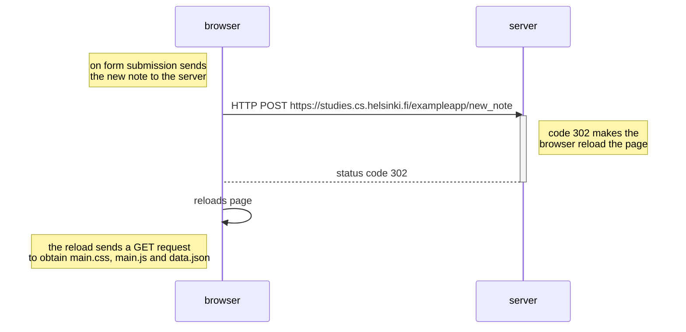

```mermaid
sequenceDiagram
    participant browser
    participant server

    Note left of browser: on form submission sends <br/> the new note to the server
    browser->>server: HTTP POST https://studies.cs.helsinki.fi/exampleapp/new_note
    activate server
    Note right of server: code 302 makes the <br/> browser reload the page
    server-->browser: status code 302
    deactivate server
    browser->>browser: reloads page
    note left of browser: the reload sends a GET request <br/> to obtain main.css, main.js and data.json


```
